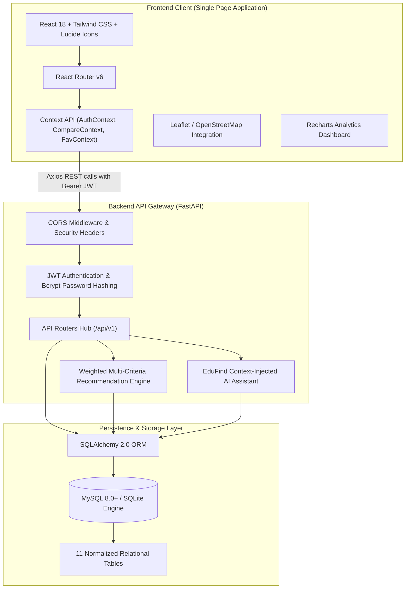
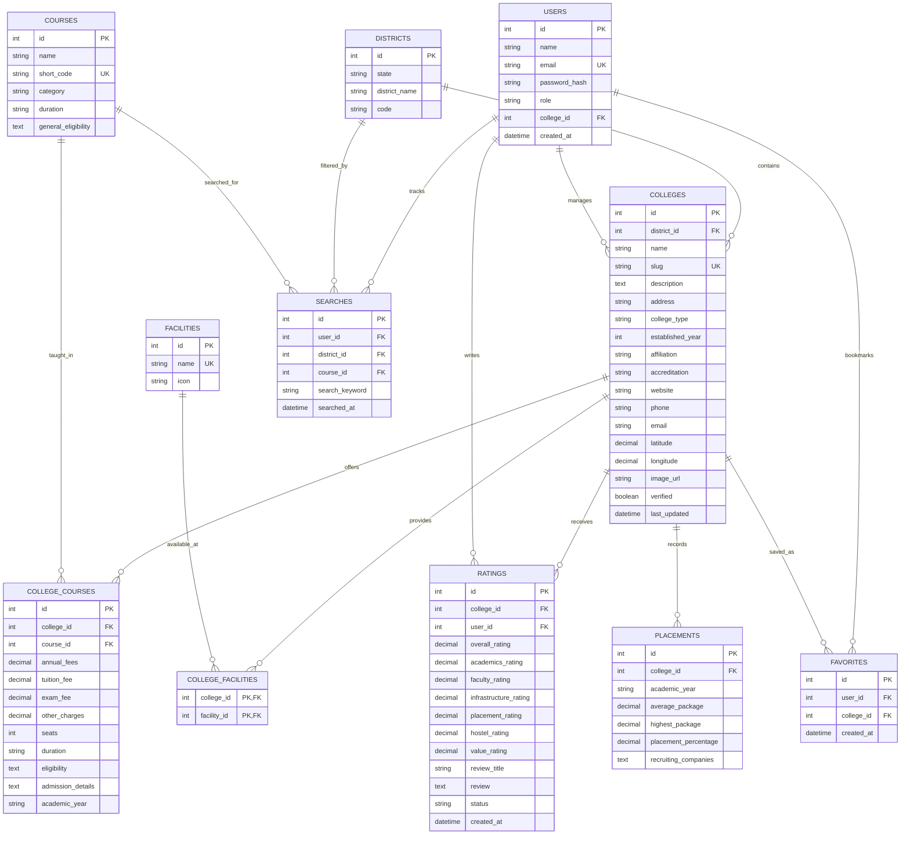

# EduFind – System Architecture & Technical Specification

## 1. Executive Summary
**EduFind** is an AI-enhanced, responsive full-stack web platform designed to solve information asymmetry in higher education discovery. Students can browse by geographical districts (e.g., Tumkur, Bangalore, Mysore), search targeted courses (e.g., BCA, MCA, B.Com, MBA, B.Sc, Engineering), inspect verified fees and facilities, compare multiple colleges side-by-side, receive multi-criteria recommendation scores, and interact with a ground-truth RAG/database-backed AI assistant.

---

## 2. High-Level 3-Tier Architecture

---

## 3. Database ER Design & Relationships

The database is fully normalized (3NF) to eliminate data redundancy and preserve integrity.

---

## 4. REST API Endpoint Design

| Method | Endpoint | Description | Auth Required |
|---|---|---|---|
| `POST` | `/api/auth/register` | Register new student or college admin | Public |
| `POST` | `/api/auth/login` | Authenticate user, return JWT bearer token | Public |
| `GET` | `/api/auth/me` | Fetch authenticated user profile | Yes (Bearer) |
| `GET` | `/api/districts` | List all districts with college count | Public |
| `GET` | `/api/districts/{id}/colleges` | List all colleges in a district with stats | Public |
| `GET` | `/api/courses` | List all standard courses (BCA, MCA, B.Com, etc.) | Public |
| `GET` | `/api/colleges/search` | Search colleges by district, course, fees, rating, type | Public |
| `GET` | `/api/colleges/{id}` | Full college profile (fees, facilities, placements, map) | Public |
| `GET` | `/api/colleges/{id}/courses` | Courses offered with exact fee breakdown | Public |
| `GET` | `/api/colleges/{id}/ratings` | Approved reviews & rating distribution breakdown | Public |
| `POST` | `/api/colleges/{id}/ratings` | Submit student review & category ratings | Student |
| `GET` | `/api/favorites` | Get list of user saved colleges | Student |
| `POST` | `/api/favorites` | Add college to favorites | Student |
| `DELETE` | `/api/favorites/{college_id}` | Remove college from favorites | Student |
| `POST` | `/api/recommendations` | Multi-criteria recommendation engine scoring | Public / Student |
| `POST` | `/api/ai/chat` | EduFind AI Assistant (ground-truth college queries) | Public |
| `GET` | `/api/admin/analytics` | Super Admin KPI metrics & chart analytics | Super Admin |
| `PUT` | `/api/admin/colleges/{id}/verify` | Verify college information & update timestamp | Super Admin |
| `PATCH` | `/api/admin/reviews/{id}` | Moderate review status (approve/reject) | Super Admin |
| `POST` | `/api/admin/colleges` | Create new college | Admin |
| `PUT` | `/api/admin/colleges/{id}` | Update college profile & admissions | Admin |
