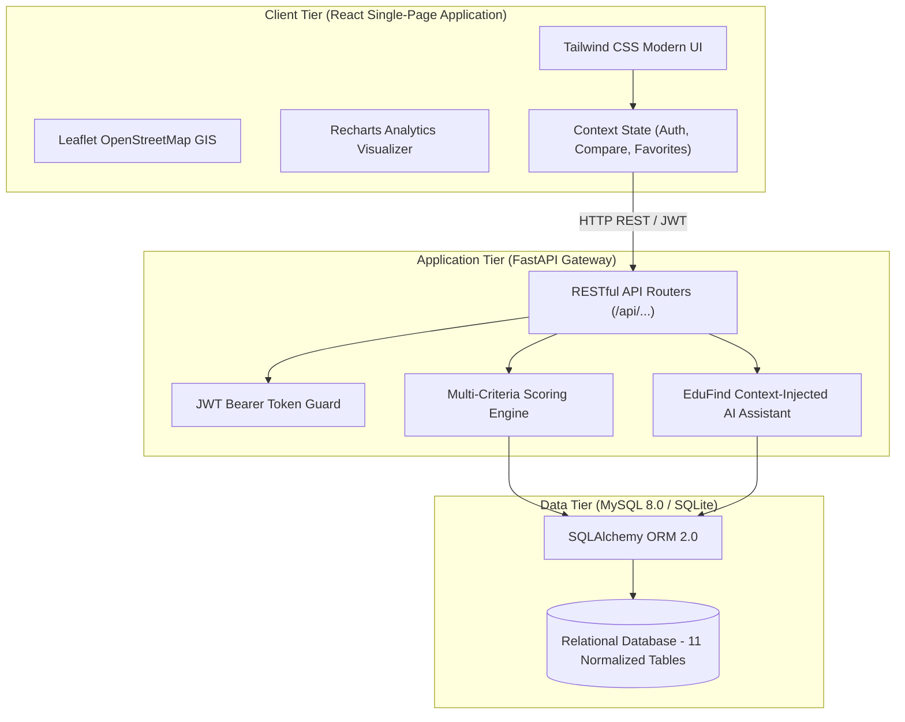
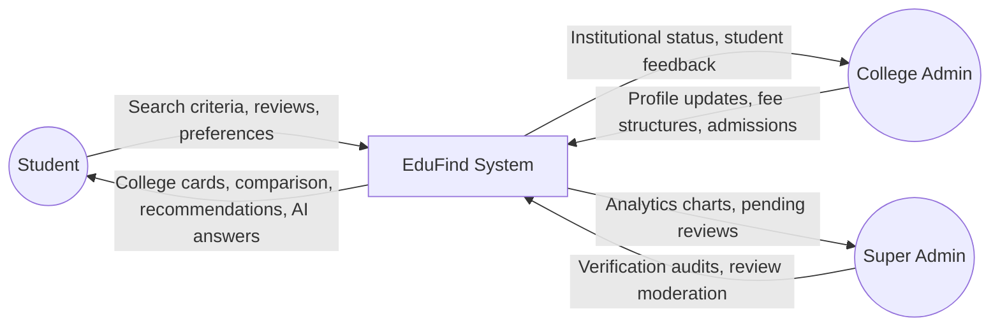
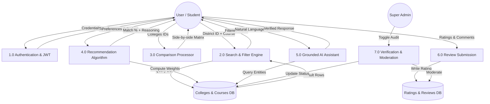

# EduFind – Smart College & Course Discovery and Recommendation System
## BCA Final Year Major Project Comprehensive Documentation & Viva Preparation Guide

---

## 1. Project Abstract
**EduFind** is an AI-powered, full-stack responsive web application designed to solve information asymmetry, fragmented college admission data, and unverified tuition fee claims for higher education aspirants. The system enables students to filter higher education institutions by geographic district (e.g., Tumkur, Bangalore, Mysore), search targeted curriculums (such as BCA, B.Com, BBA, MCA, MBA, B.Sc, Engineering), inspect official audited fee breakdowns, review campus hostel and placement records, evaluate verified student reviews across 6 categories, compare multiple colleges side-by-side, and receive transparent multi-criteria recommendations. The platform also embeds a bounded **EduFind AI Assistant** that retrieves information directly from verified institutional database records without hallucinations. Built using React.js, Tailwind CSS, Leaflet GIS, FastAPI, SQLAlchemy, and MySQL, the application serves students, institutional administrators, and super administrators.

---

## 2. Introduction
Choosing the right college and academic program is one of the most critical decisions in a student's career. In developing regions and tier-2 districts like Tumkur, students often struggle to find clear, reliable, and up-to-date information regarding course eligibility, annual tuition fees, examination costs, hostel facilities, and genuine campus placement records. Conventional education portals are frequently overcrowded with paid advertisements, lack verified district-level granularity, or present outdated figures. **EduFind** addresses these challenges by introducing a centralized, verified, and intelligent educational discovery platform.

---

## 3. Problem Statement
1. **Scattered Information**: College admission details and fee structures are scattered across brochures, unverified forums, and third-party commercial portals.
2. **Hidden and Inaccurate Fees**: Published fees often omit examination fees, lab charges, or hostel expenses, causing unexpected financial strain on families.
3. **Lack of District-Level Focus**: Students wishing to study in their home district (e.g., Tumkur) cannot easily filter colleges by district combined with specific courses (e.g., BCA).
4. **Unreliable Ratings and Reviews**: Existing portals often suffer from duplicate, unverified, or biased reviews.
5. **AI Hallucination in Generic Chatbots**: Generic large language models frequently invent fake college cutoffs or placement packages.

---

## 4. Existing System vs. Proposed System

| Feature | Existing Portals | Proposed EduFind System |
|---|---|---|
| **District Filtering** | Broad state/metro focus only | Granular district selection (Tumkur, Bangalore, etc.) |
| **Fee Accuracy** | Lumpsum estimate or missing | Audited breakdowns (Tuition, Exam, Other, AY tracking) |
| **Institution Verification**| Unverified crowd-sourced data | Admin verification badge with "Last Updated" audit stamp |
| **Reviews & Ratings** | Single generic 1-5 star score | 6 distinct category ratings with duplicate review prevention |
| **Comparison Tool** | Generic ads or limited | Dynamic side-by-side matrix highlighting best values |
| **Recommendation Engine**| Basic keyword search | Weighted multi-criteria matching score with reasoning |
| **AI Assistant** | Generic or non-existent | Ground-truth bounded AI strictly answering from verified DB |
| **Geographic Mapping** | Text address only | Interactive Leaflet + OpenStreetMap with directions |

---

## 5. Objectives & Scope

### Primary Objectives:
- Provide an intuitive, mobile-responsive web platform for discovering accredited colleges in Karnataka.
- Deliver verified annual fee structures with explicit academic year tracking.
- Enable granular district-level search (e.g., colleges offering BCA in Tumkur).
- Implement a 6-category rating system (Academics, Faculty, Infrastructure, Placements, Hostel, Value for Money).
- Provide a side-by-side comparison matrix for up to 3 institutions.
- Develop a multi-criteria recommendation algorithm calculating transparent match scores (%).
- Integrate an AI assistant that answers questions directly from the database without hallucinations.

### Project Scope:
The current implementation focuses on colleges and universities across Karnataka (specifically highlighting Tumkur, Bangalore Urban, Mysore, Dakshina Kannada, Belagavi, Shimoga, and Dharwad), covering undergraduate and postgraduate courses in Computer Applications, Commerce, Management, Science, and Engineering. The architecture is modular and scalable to pan-India institutions.

---

## 6. Functional & Non-Functional Requirements

### Functional Requirements:
1. **User Authentication & Authorization**: Secure JWT-based registration and login for Students, College Admins, and Super Admins.
2. **District Browsing & Live Statistics**: Dynamic aggregation of colleges, course counts, and average ratings per district.
3. **Advanced Filtering & Sorting**: Filter by course, fee brackets (Under ₹25k, ₹25k–₹50k, ₹50k–₹1L, Above ₹1L), minimum rating, facilities, and institution type. Sort by fees, ratings, and names.
4. **Comprehensive College Profile**: Basic info, about description, courses table, fee breakdowns, admissions, facilities, placement statistics, map, and verified badges.
5. **Multi-College Comparison**: Dynamic 3-college matrix comparing ratings, fees, hostels, packages, and eligibility.
6. **Smart Recommendation Engine**: Multi-criteria weighted scoring algorithm with natural language reasoning.
7. **EduFind AI Assistant**: Context-injected chatbot with fallback guarantee.
8. **Institutional Administration**: College profile updates, course additions, and fee revisions.
9. **Super Admin Dashboard**: Recharts analytics, verification audit toggles, and review moderation.

### Non-Functional Requirements:
- **Performance**: Sub-200ms REST API response times; sub-second client-side filtering.
- **Security**: Passwords hashed using bcrypt; JWT authentication tokens signed with HS256; SQL injection protection via SQLAlchemy ORM; CORS controls.
- **Reliability & Groundedness**: Zero fabricated data; missing placement/fee attributes return "Not available".
- **Usability**: Clean educational UI styled with Tailwind CSS, responsive on mobile, tablet, and desktop.

---

## 7. System Hardware & Software Requirements

### Hardware Requirements:
- **Processor**: Intel Core i3 / AMD Ryzen 3 or higher.
- **RAM**: 4 GB minimum (8 GB recommended).
- **Hard Disk**: 2 GB free disk space.
- **Network**: Internet connection for OpenStreetMap tiles and CDNs.

### Software Requirements:
- **Operating System**: Windows 10/11, macOS, or Linux.
- **Frontend Stack**: React 18, Vite 5, Tailwind CSS, Lucide React, React-Leaflet, Recharts.
- **Backend Stack**: Python 3.12+, FastAPI, Uvicorn, Pydantic v2.
- **ORM & Database**: SQLAlchemy 2.0, MySQL 8.0+ / SQLite.
- **Authentication**: `python-jose`, `bcrypt`.
- **Browser**: Modern Chromium (Chrome, Edge), Firefox, or Safari.

---

## 8. System Architecture Diagram

---

## 9. Data Flow Diagrams (DFD)

### DFD Level 0 (Context Level):

### DFD Level 1:

---

## 10. Entity-Relationship (ER) Diagram Description

The database schema is structured into **11 normalized relational tables**:
1. **users**: Primary key `id`, email (unique), password_hash, role (`student`, `college_admin`, `super_admin`), `college_id` foreign key.
2. **districts**: Primary key `id`, state, district_name, code.
3. **colleges**: Primary key `id`, foreign key `district_id` references `districts(id)`, unique slug, name, college_type, accreditation, coordinates (`latitude`, `longitude`), `verified` boolean, `last_updated` audit timestamp.
4. **courses**: Primary key `id`, name, short_code (unique), category, duration, general_eligibility.
5. **college_courses**: Bridge entity mapping colleges to courses with detailed fee breakdowns: `annual_fees`, `tuition_fee`, `exam_fee`, `other_charges`, seats, duration, eligibility, and academic year.
6. **facilities**: Primary key `id`, unique facility name, icon.
7. **college_facilities**: Many-to-many junction table between `colleges` and `facilities`.
8. **ratings**: Primary key `id`, foreign keys to `colleges(id)` and `users(id)`, overall rating, 6 category ratings (Academics, Faculty, Infrastructure, Placements, Hostel, Value for Money), review comments, moderation status (`pending`, `approved`, `rejected`), created_at.
9. **placements**: Primary key `id`, foreign key `college_id`, academic year, average_package, highest_package, placement_percentage, recruiting_companies.
10. **favorites**: Primary key `id`, foreign keys `user_id` and `college_id` with unique constraint to prevent duplicates.
11. **searches**: Primary key `id`, tracks search keywords, district_id, course_id, and timestamps for administrator search trend analytics.

---

## 11. Module Description

1. **Authentication & Access Control Module**: Manages registration, bcrypt password hashing, JWT bearer generation, and role authorization guards.
2. **Geographical District Discovery Module**: Aggregates higher education metrics per district and routes students directly to local offerings.
3. **Course Search & Filter Module**: Multi-criteria parametric search across courses, fees, ratings, facilities, and college types.
4. **Institutional Profile & Verified Fee Breakdown Module**: Presents audited academic year fees, application steps, mandatory documents, and Leaflet map location.
5. **Multi-College Comparison Matrix Module**: Renders side-by-side 3-way evaluation with automated highlighting of lowest fees and best ratings.
6. **Multi-Criteria Recommendation Engine**: Computes normalized match percentage scores (e.g., 98% Match) with transparent natural language justification.
7. **EduFind AI Knowledge Assistant**: Extracts structured entities and provides grounded, factual answers strictly bounded to verified database facts.
8. **Institutional & Super Admin Module**: Recharts data visualizations, college verification toggles, and review moderation.

---

## 12. Testing & Quality Assurance

| Test ID | Test Scenario | Input Data | Expected Output | Status |
|---|---|---|---|---|
| **TC-01** | Student Login with valid credentials | `rahul.student@gmail.com` / `EduFind@123` | 200 OK, returns JWT Bearer token & student profile | **Passed** |
| **TC-02** | Prevent duplicate review submission | User 3 submitting 2nd review for College 1 | 400 Bad Request: "You have already submitted a review..." | **Passed** |
| **TC-03** | Search Tumkur colleges offering BCA | `district_id=1`, `course=BCA` | Returns only Tumkur colleges offering BCA | **Passed** |
| **TC-04** | AI Assistant Lowest BCA Fee query | "Which college has the lowest BCA fees?" | Grounded response identifying GFGC Tumkur (₹18,500/yr) | **Passed** |
| **TC-05** | AI Assistant Unverified query fallback | "What is the fee for Aerospace Engineering in Alaska?" | Fallback: "I could not find verified information..." | **Passed** |
| **TC-06** | Recommendation score computation | Budget: ₹75,000, Course: BCA, Hostel: True | Returns SIT Tumkur (98% Match) with transparent reasoning | **Passed** |
| **TC-07** | Admin verification toggle | `college_id=1`, `verified=true` | 200 OK, verified badge displays immediately on card | **Passed** |

---

## 13. Future Enhancements
- **Direct Online Admission Application Gateway**: Allow students to submit admission forms and upload verified certificates directly through EduFind.
- **Scholarship Finder Engine**: Match state and central government scholarships (SSP, NSP) based on student category and family income.
- **Virtual 360° Campus Tours**: Embed interactive WebGL / panoramic campus walkthroughs.
- **Alumni Mentorship Connect**: Enable direct messaging between prospective applicants and verified college alumni.

---

## 14. Conclusion
The **EduFind – Smart College & Course Discovery and Recommendation System** successfully demonstrates an end-to-end full-stack educational web application. By replacing fragmented and commercialized education websites with verified, district-level data, clear fee breakdowns, transparent recommendation scoring, Leaflet GIS mapping, and a ground-truth bounded AI assistant, EduFind bridges the information gap for students pursuing higher education.

---

# BCA Viva Questions and Answers (Comprehensive Guide)

### Q1: What is the main objective of the EduFind project?
**Answer**: EduFind is an AI-powered higher education discovery and recommendation platform designed to help students discover colleges based on district, course (e.g. BCA, MCA, B.Com), verified annual fee structures, facilities, placements, and ratings, while providing side-by-side comparisons and a grounded AI assistant.

### Q2: Why did you choose FastAPI for the backend instead of traditional Flask or Django?
**Answer**: FastAPI provides asynchronous I/O (`async`/`await`), high concurrency performance comparable to NodeJS and Go, automatic data validation through Pydantic schemas, and built-in interactive Swagger UI documentation at `/docs`.

### Q3: How does your recommendation algorithm calculate the "Match Score"?
**Answer**: The recommendation engine uses a multi-criteria weighted scoring algorithm:
- Course match & availability: 30 points
- Budget & annual fee affinity: 20 points
- Student & academic ratings: 20 points
- Facilities (e.g., campus hostel requirement): 15 points
- Placement package track record: 10 points
- College type and accreditation: 5 points  
The total is normalized to a percentage (e.g. 98% Match) and synthesized into a natural language reasoning explanation.

### Q4: How do you prevent AI hallucinations in the EduFind AI Assistant?
**Answer**: Generic LLMs hallucinate non-existent cutoffs when asked about colleges. EduFind implements a **ground-truth bounded knowledge engine**: queries are matched against verified database records. If the requested information is not present in the verified database, the system strictly returns: *"I could not find verified information about this in the EduFind database."*

### Q5: How do you handle password security and authentication?
**Answer**: Plaintext passwords are never stored. Passwords are salted and hashed using `bcrypt`. Authentication uses JSON Web Tokens (JWT) signed with the HS256 algorithm and passed via HTTP Authorization Bearer headers. Role-based access control enforces permissions for Students, College Admins, and Super Admins.

### Q6: How does the database schema ensure data integrity?
**Answer**: The database is normalized to 3NF. It uses foreign key constraints with `ON DELETE CASCADE` or `SET NULL`, unique constraints (e.g. `(user_id, college_id)` on the ratings table to prevent duplicate reviews, and unique slugs for college URLs), and indexed lookup columns.

### Q7: How does the map feature work?
**Answer**: The map feature uses **Leaflet** with **OpenStreetMap** tile layers. Latitudes and longitudes stored in the database are passed to a React Leaflet component that renders an interactive pin marker, popup with college details, and an external navigation link to Google Maps for live driving directions.

### Q8: What is the significance of the "Last Updated" and "Verified" attributes?
**Answer**: Educational fees and university affiliations change each academic year. EduFind tracks the `academic_year` and timestamp of when data was audited. The Super Admin can toggle the `verified` badge, ensuring students know whether information has been verified by the administration.
